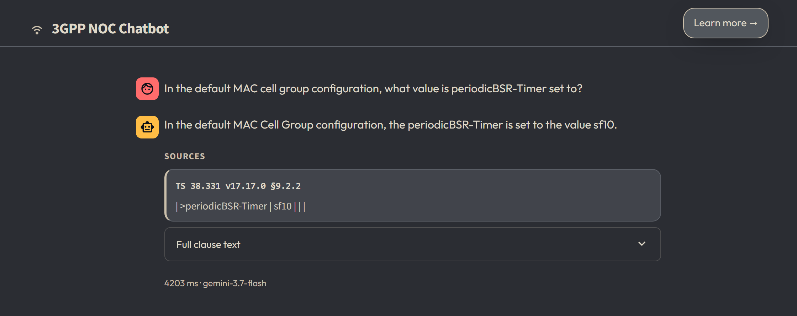
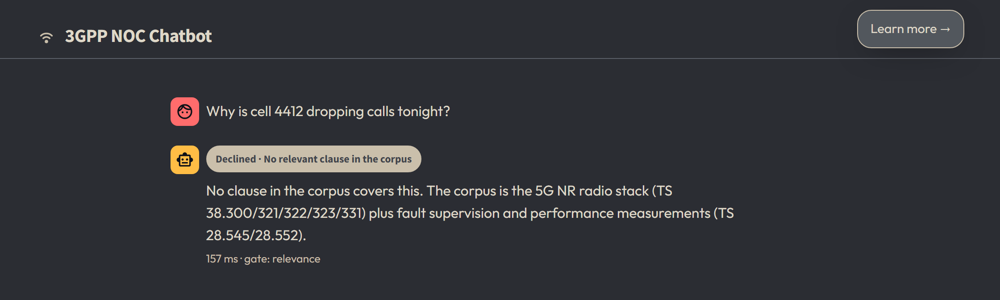
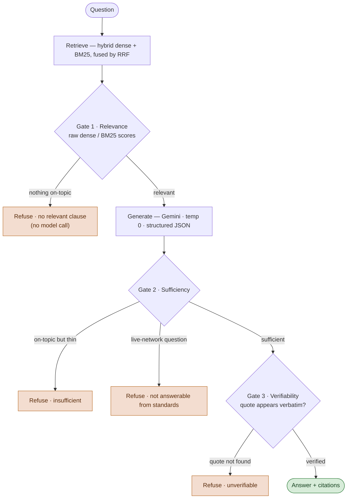
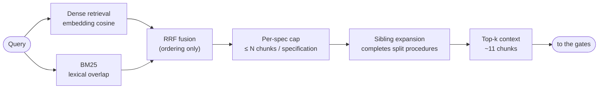
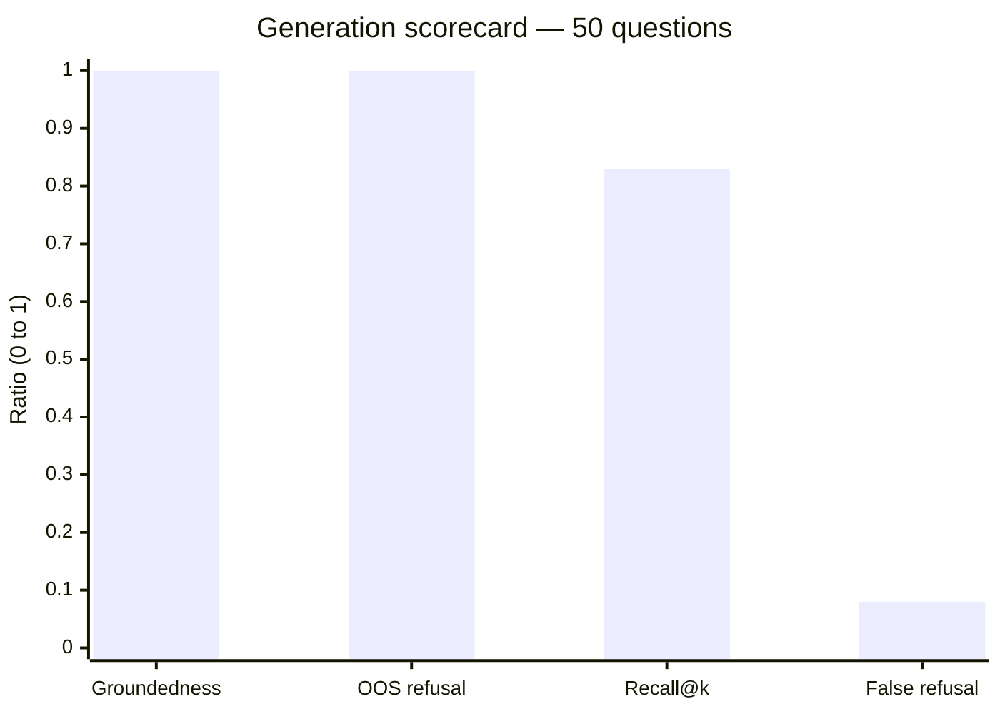
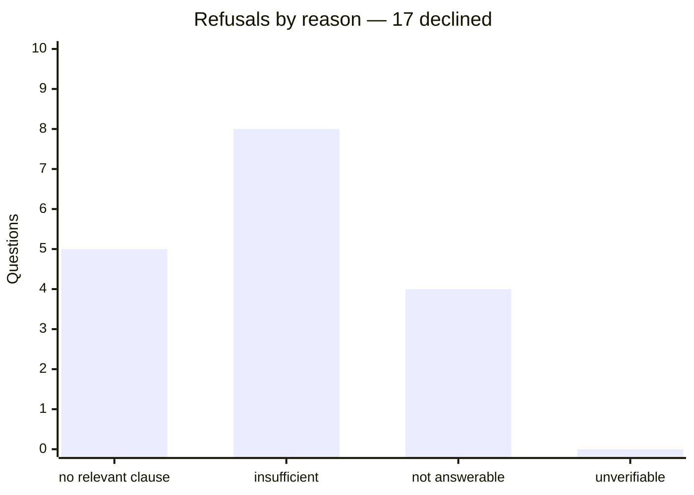

# 3GPP NOC Chatbot

A question-answering assistant over a fixed corpus of 3GPP 5G specifications.
It answers with an **exact clause citation**, or it **explicitly declines** —
it has no knowledge outside the corpus and never guesses.

Built for a network-operations audience: the questions a NOC engineer asks about
the 5G NR radio stack, fault supervision and performance measurements, answered
only from the standards, with the clause shown as evidence.

---

## Demo

https://github.com/user-attachments/assets/d2fd9ce3-a216-48cc-a519-3c63188e6c69

The two behaviours that matter, taken verbatim from the evaluation set.

**A grounded answer, with its clause as the evidence:**

> **Q —** In the default MAC cell group configuration, what value is
> `periodicBSR-Timer` set to?
>
> **A —** In the default MAC Cell Group configuration, the `periodicBSR-Timer`
> is set to the value `sf10`.
>
> &nbsp;&nbsp;📎 &nbsp;**TS 38.331** · RRC · Release 17 · clause **9.2.2**

**A refusal instead of a guess** — a plausible operations question the standards
cannot answer, because it is about a live network rather than the specification:

> **Q —** Handsets on one cell keep dropping back to idle a few seconds after the
> radio gets bad. Which timer and counter chain produces that behaviour?
>
> **⊘ Declined — not answerable from the standards.** This asks about a live
> network. I am grounded only in 3GPP specifications and have no access to
> telemetry.

Run it yourself with the two commands in [Running it locally](#running-it-locally).

**A grounded answer, cited to its clause:**



**A refusal instead of a guess:**



---

## Why this exists

A general chatbot will confidently answer a 3GPP question whether or not it
actually knows — and a plausible-but-wrong answer about a standard is worse than
no answer. This system inverts that default:

- **Grounded.** Every answer is drawn from retrieved clauses of the corpus.
- **Cited.** Each answer carries the 3GPP specification number, pinned version
  and clause id, plus a supporting quote that is checked, in code, to appear
  verbatim in the cited clause.
- **Refuses when unsure.** A refusal is a correct outcome, not a failure. The
  assistant declines whenever grounding cannot be established, and says which of
  four reasons applies.

A refusal is never a fallback for a broken answer path — it is the designed
response whenever the corpus does not support a grounded reply.

---

## How it works

Every question runs the same pipeline. Three independent, deterministic **gates**
sit outside the language model; any of them can turn a question into a refusal.



- **Retrieval ordering uses Reciprocal Rank Fusion; gating never does.** Fused
  ranks carry no absolute relevance, so Gate 1 thresholds the raw dense-cosine
  and BM25 scores instead.
- **The four refusal reasons are reported separately**, because they mean
  different things to the reader: *no relevant clause*, *insufficient*, *not
  answerable from the standards* (a live-network question), and *unverifiable*.

### Retrieval

Retrieval runs two searches and fuses them, then shapes the result so one
specification cannot crowd out the rest and a procedure split across sibling
clauses is kept whole.



---

## Preventing hallucination

The single design goal is to make a confident, wrong answer about a standard
structurally hard to produce, not merely unlikely. A hallucinated 3GPP answer is
worse than no answer, so every plausible failure mode is closed by a specific
mechanism rather than by trusting the model to behave:

| How a hallucination would arise | What blocks it |
|---------------------------------|----------------|
| The model answers from its own training knowledge of 3GPP | The prompt supplies only the retrieved clauses and forbids outside knowledge; generation runs at temperature 0. |
| The model answers when nothing on-topic was retrieved | **Gate 1** refuses on the raw retrieval scores, *before any model call is made*. |
| The model pads a thin or off-target context into a confident answer | **Gate 2** requires the model to declare the retrieved context sufficient, and to flag live-network questions the standards cannot answer. |
| The model invents a clause id, or paraphrases / fabricates a quote | **Gate 3** checks, in code, that every supporting quote appears **verbatim** in the clause it cites. A fabricated or altered citation is rejected and withheld, not shown. |
| A quote that is real but does not actually support the answer slips through | Offline evaluation judges groundedness with a **different model** than the one that generated the answer, so the check is independent of the thing it grades. |

The three gates are deterministic and sit **outside** the language model, so none
of them can be talked out of a refusal. When grounding cannot be established the
system declines, and says which of four reasons applies — a refusal is the
designed response, never a broken answer path.

The outcome is measured, not asserted. On the frozen evaluation set every answer
the system produced was grounded in the clause it cited (**33/33**), and every
out-of-scope question was declined (**14/14**). See
[Evaluation](#evaluation) for the full scorecard and the committed per-question
results.

---

## The corpus

Seven specifications, all pinned to **Release 17** so a cross-specification
answer describes one coherent version of the system. Downloaded from the 3GPP
archive and indexed into **2,085 chunks** (one leaf clause plus its breadcrumb
per chunk).

| Spec       | Version  | Scope                      |
|------------|----------|----------------------------|
| TS 38.300  | 17.17.0  | NR overall description     |
| TS 38.321  | 17.15.0  | MAC protocol               |
| TS 38.322  | 17.4.0   | RLC protocol               |
| TS 38.323  | 17.5.0   | PDCP protocol              |
| TS 38.331  | 17.17.0  | RRC protocol               |
| TS 28.545  | 17.0.0   | Fault supervision          |
| TS 28.552  | 17.17.0  | Performance measurements   |

ASN.1 information-element sections are excluded from the corpus (they are
enormous, near-duplicate, and defeat one-chunk-one-identity); annex clauses are
included.

---

## Evaluation

The evaluation set is the submission's evidence, so it is guarded against a
circular result:

- **Frozen before any retrieval code existed.** The question set was authored
  and committed before any retrieval or threshold-tuning code was written, so
  the questions could not be shaped to fit the retriever. Questions may be added
  afterward, never rewritten — especially not one the system fails.
- **Authored by reading the specifications, not the chunks.** Questions written
  from chunk text inherit its vocabulary and inflate retrieval toward 1.0. Gold
  clause ids were read from the documents, never taken from system output.
- **50 questions**: 36 answerable, 14 refusals.
- **The groundedness judge is a different model than the generator.** Answers
  are generated by Gemini; groundedness is judged by Groq (`openai/gpt-oss-120b`),
  because a model grading its own output is biased toward it.

**Retrieval** (measured, in-sample on the frozen set): full-gold recall
**30/36 (83%)** — single-clause 18/18, cross-specification 3/5 — at ~11 chunks of
context.

**Generation** (all 50 questions, `gemini-3.7-flash`, groundedness judged by
`openai/gpt-oss-120b`):

| Metric | Result |
|--------|--------|
| Groundedness — judged answers supported by their cited clauses | **33 / 33 (1.00)** |
| Out-of-scope refusal — out-of-scope questions correctly declined | **14 / 14 (1.00)** |
| Full-gold retrieval recall | **30 / 36 (0.83)** |
| False-refusal rate — answerable questions wrongly declined | **3 / 36 (0.08)** |

Every answer the system produced was grounded in the clauses it cited, and every
out-of-scope question was refused. The three false refusals are the safe error
direction: the system withholds rather than risk an unsupported answer.



*Higher is better for the first three; **lower** is better for false refusal.*

**Refusal behaviour.** 17 of the 50 questions were declined — 14 of them
correctly (every out-of-scope question), 3 of them false refusals of answerable
questions. Gate 3 (verifiability) never had to fire: no generated answer reached
the user with a quote that failed the verbatim check.



The full published run is committed as
[`eval/results/gemini.sanitized.json`](eval/results/gemini.sanitized.json) — the
per-question outcomes behind the numbers above (retrieval recall, refusal reason,
groundedness verdict, latency), with the generated answer text removed because it
reproduces copyrighted 3GPP clause content. Results are produced by `evaluate.py`
and written to `eval/results/`. Reproduce the full, un-sanitized run with:

```bash
uv run python evaluate.py --provider gemini --judge
```

> **Note:** the published run leads with `gemini-3.7-flash`. Groq failover is
> intentionally not used for generation — its free-tier token cap rejects the
> ~12k-token retrieval prompt — so the evaluation is single-model by design.

---

## Running it locally

Requirements: **Python 3.11**, [`uv`](https://docs.astral.sh/uv/), and
**LibreOffice** (headless, for normalising the one legacy `.doc` specification).

```bash
# 1. install dependencies
uv sync

# 2. provide API keys
cp .env.example .env        # then fill in GEMINI_API_KEY and GROQ_API_KEY

# 3. build the index from the 3GPP archive (downloads specs, ~a few minutes)
uv run python -m noc_copilot.ingest

# 4. run the API and the UI
uv run uvicorn noc_copilot.api:app --port 8000     # in one terminal
uv run streamlit run app.py --server.port 7860     # in another
```

The Streamlit client is a thin layer over the FastAPI service — no logic lives
in the UI. Open `http://localhost:7860`.

### Configuration

- `config/specs.yaml` — the seven specifications, their pinned versions, and the
  clause exclusions.
- `config/settings.yaml` — model ids, retrieval shaping, and the calibrated
  gate thresholds (`cosine_threshold`, `bm25_threshold`).

---

## Tech stack

Python 3.11 · ChromaDB (vector store) · rank-bm25 · Google Gemini (generation) ·
Groq (groundedness judge) · FastAPI (service) · Streamlit (client) · `uv`
(packaging). No LangChain, LlamaIndex, or agent framework — the pipeline is
explicit.

---

## Project layout

```
src/noc_copilot/   ingest, retrieval, gates, generation, pipeline, API
app.py             Streamlit router
views/             demo and documentation pages
eval/              frozen question set + results
config/            specs and settings
evaluate.py        evaluation harness
```

---

## Copyright

3GPP specification text is © 3GPP. This repository does **not** contain the raw
specification documents (`data/raw/` and `data/normalised/` are git-ignored).
Retrieved clauses are shown only as short, cited quotations. See `NOTICE.md`.
